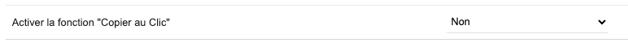
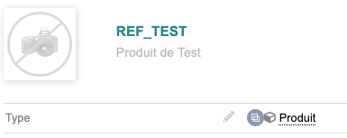
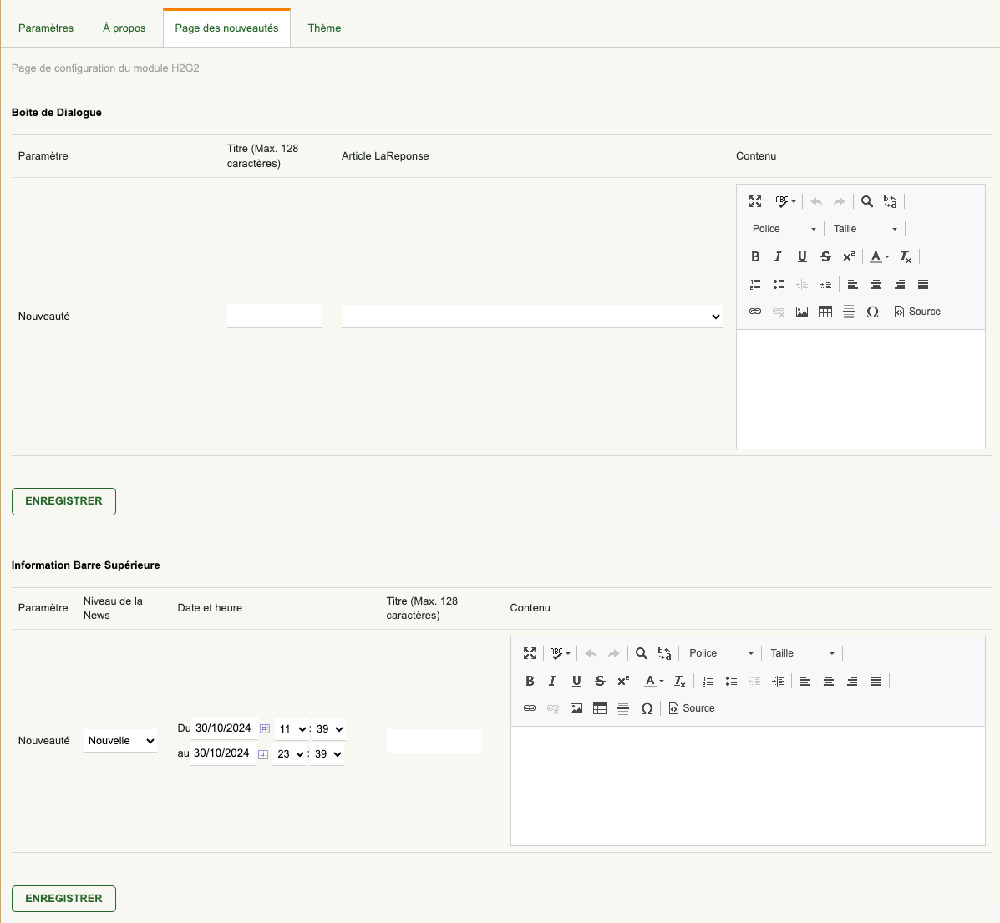
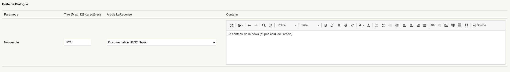
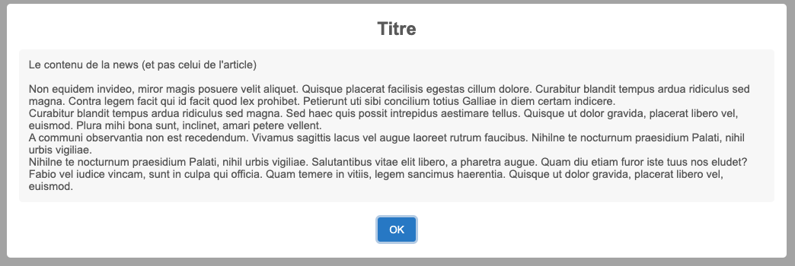
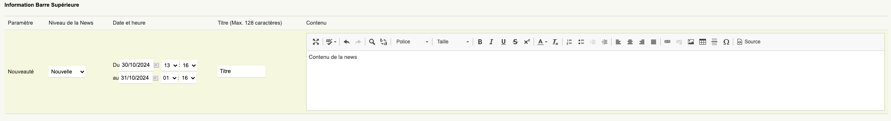
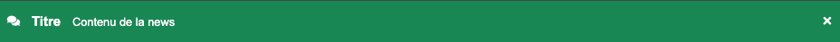

# Documentation Utilisateur

---

## Copy On Click

Dans la configuration du module, il est possible d'activer ou non la fonctionnalité "Copy On Click" :  

Cette fonctionnalité ajoute un bouton au niveau des lignes d'une fiche, permettant de copier/coller facilement l'information.  

---

## Nouveautés : Boîte de dialogue / Barre d’information supérieure

Dans la configuration du module, il est possible de générer des "nouveautés" :

### Boîte de dialogue

Dans la section **Boîte de dialogue** :

| Paramètre         | Explication                                                                                                                        | Valeur à mettre                 |
|-------------------|------------------------------------------------------------------------------------------------------------------------------------|---------------------------------|
| Nouveauté         | Activer ou non la nouveauté dans la boîte de dialogue                                                                              | Oui ou Non                      |
| Titre             | Titre de la nouveauté apparaissant en haut de la boîte de dialogue                                                                 | Le titre souhaité               |
| Article LaReponse | Si le module `LaReponse` est activé, il est possible de sélectionner un article pour afficher son contenu dans la boîte de dialogue | Sélectionner l'article souhaité |
| Contenu           | Le contenu de la nouveauté (HTML/CSS accepté), placé au-dessus du contenu de l'article                                             | Le contenu souhaité             |

- Exemple :  
  

- Rendu :  
  

### Barre d’information supérieure

Dans la section **Barre d’information supérieure** :

| Paramètre         | Explication                                                                                                                                                                                                                                                                                                                                                      | Valeur à mettre           |
|-------------------|------------------------------------------------------------------------------------------------------------------------------------------------------------------------------------------------------------------------------------------------------------------------------------------------------------------------------------------------------------------|---------------------------|
| Nouveauté         | Activer ou non la nouveauté dans la barre d’information                                                                                                                                                                                                                                                                                                        | Oui ou Non                |
| Niveau de la News | Niveau de priorité de la nouveauté, parmi les 4 disponibles : <ul><li style="background-color: #198754; padding: 0px 5px;margin: 5px 0px; border-radius:5px">Nouvelle</li><li style="background-color: #2778c4; padding: 0px 5px;margin: 5px 0px; border-radius:5px">Informatif</li><li style="background-color: #e09200;color:black; padding: 0px 5px;margin: 5px 0px; border-radius:5px">Attention</li><li style="background-color: #dc3545; padding: 0px 5px;margin: 5px 0px; border-radius:5px">Important</li></ul> | Le niveau souhaité        |
| Date et Heure     | Date de début et de fin de l'affichage de la nouveauté                                                                                                                                                                                                                                                                                                         | Les dates/heure souhaitées |
| Titre             | Titre de la nouveauté apparaissant à gauche de la barre d’information                                                                                                                                                                                                                                                  | Le titre souhaité         |
| Contenu           | Contenu de la nouveauté (HTML/CSS accepté), placé au-dessus du contenu de l'article                                                                                                                                                                                                                                      | Le contenu souhaité       |

- Exemple :  
  

- Rendu :  
  

Attention : une nouveauté avec le niveau "Important" ne peut pas être retirée via la croix.
