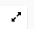
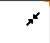

# Guide d'utilisation du Module Dolibarr "laReponse"

**Introduction :**
Le Module Dolibarr "laReponse", développé par l'entreprise "Code42", vise à simplifier la gestion des articles, des tags et des fonctionnalités associées dans Dolibarr. Ce guide a été créé pour vous aider à utiliser efficacement le module, même si vous n'êtes pas familier avec Dolibarr.

## 1. Installation du module

- Assurez-vous d'avoir une version Dolibarr compatible avec le module (minimum **v13**).
- Téléchargez le Module Dolibarr "laReponse" depuis [le Dolistore](https://www.dolistore.com/fr/modules/1339-Base-de-connaissance---LaReponse---CODE-42.html)
- Suivez les instructions d'installation fournies pour ajouter le module à votre instance Dolibarr.

## 2. Interface principale

Après l'installation, vous verrez un nouveau menu en haut (thème Eldy) ou à gauche (thème Quarantedeux) dans Dolibarr. Cliquez sur le menu "laReponse" pour accéder au module.

## 3. Création d'articles

Pour créer un nouvel article :

1. Cliquez sur "Nouvel article".
2. Remplissez le titre : donnez un titre pertinent à votre article.
3. Sélectionnez un type :
   - **Article** : Insérez le contenu de l'article sous forme de texte
   - **URL** : Insérez une URL vers la page internet que vous souhaitez afficher dans l'article
3. Remplissez les autres champs requis :
- **État** : spécifiez si l'article est "Interne" (accesible à tous les utilisateurs du Dolibarr) ou "Privé" (seul l'auteur de l'article peut y accédeer).
- **Contenu** / **URL du contenu** : insérez le contenu de l'article en utilisant l'éditeur WYSIWYG (doit etre activé). Vous pouvez y ajouter des images et du code HTML. / Insérez une URL vers la page internet que vous souhaitez afficher dans l'article
- **Tags** : ajoutez des tags pertinents pour organiser et catégoriser votre article (tags Dolibarr ou tags laReponse).

## 4. Gestion des articles

Pour gérer vos articles existants :

- Accédez à la liste des articles pour voir tous les articles existants.
- Utilisez les filtres de recherche pour trouver des articles par titre, contenu ou tags.
- Vous pouvez également rechercher des articles internes ou privés.
- Modifiez les articles existants en cliquant sur leur titre dans la liste.

## 5. Commentaires et favoris

Pour enrichir vos articles et les marquer en favoris :

- Ajoutez des commentaires à un article pour fournir des informations supplémentaires. Vous pouvez y insérer des images et du code HTML.
- Modifiez vos propres articles en cliquant sur "Modifier".
- Mettez des articles en favoris pour un accès rapide ultérieur.

## 6. Publication d'articles

Pour rendre vos articles accessibles au public en dehors de Dolibarr :

1. Cliquez sur l'option de "Publier".
2. Générez un lien d'article public.
3. Partagez le lien d'article public avec d'autres personnes pour diffuser les informations.

Sur un article "URL", il est possible de passer en plein écran en cliquant sur l'icône  et de le quitter en cliquant sur 

## 7. Importation de fichiers JSON

Pour créer ou mettre à jour des articles en masse :

1. Préparez un fichier JSON avec les données appropriées pour chaque article.
2. Accédez à l'option d'importation.
3. Sélectionnez le fichier JSON et lancez le processus d'importation.

## 8. Personnalisation des listings et des tags

Pour personnaliser l'interface et les tags :

- Activez le "wizard" de personnalisation pour modifier l'apparence des listings et afficher un message personnalisé.
- Utilisez les fonctionnalités de gestion des tags pour organiser et catégoriser vos articles.

##  9. Statut

comme dit précédemment, un article peut etre **Interne**, **Privé** et aussi être **Publié** :

**Interne** : Un article **interne** est un article accessible à tout les utilisateurs du dolibarr

**Privé** : Un Article **privé** est un article accessible uniquement par son créateur

**Publié** : **Publier** un article consite à rendre son article acccesible à toute personne possédant le lien de l'article (fait abstraction du statut **interne/privé**)

Si vous avez d'autres questions ou besoin d'une assistance supplémentaire, n'hésitez pas à nous contacter via le bouton adéquat ou en cliquanr sur ce [lien](https://www.code42.store/contactus.php?module=Lareponse).